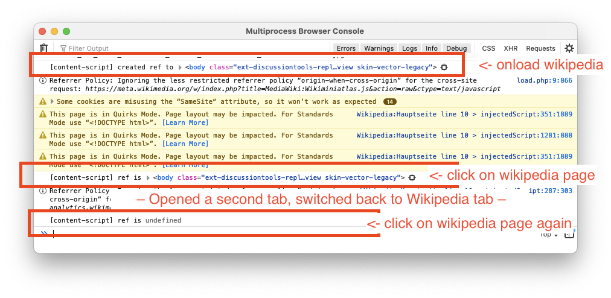

# Issue

Inside an add-on's content-script, any `WeakRef` to any DOM element on the page it operates on seems to lose its reference faster than that the actual object goes out of scope.

# Steps to reproduce

1. Install this add-on
  -  Use `npm install && npm run firefox`
  - Or go to about:debugging and load the `extension/manifest.json` file as a temporary add-on. 
2. Open the Browser Console inside Firefox
3. Go to a random page, e.g. https://de.wikipedia.org
4. Click on the page, see that the `[content-script] ...` log line has a reference
5. Open a second tab
6. Switch back to the wikipedia page
7. Click it, and see that `[content-script] ...` log line now says that the reference is `undefined`.

